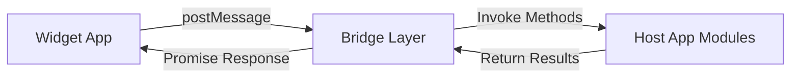

# Dailie Widget SDK Usage Guide

## 📖 Introduction

`dailie-widget-sdk` is a React SDK for developing widgets on the Dailie platform. It provides a comprehensive set of APIs that enable developers to easily create feature-rich and interactive widgets.

## 🚀 Quick Start

### Installation

Install the SDK in your widget project:

```bash
pnpm add dailie-widget-sdk
# or
npm install dailie-widget-sdk
```

### Basic Usage

```tsx
import { useWidgetContext, ui } from "dailie-widget-sdk";

export default function Widget() {
  const { context } = useWidgetContext();

  if (!context) return <div>Loading...</div>;

  return (
    <div>
      <h1>My First Widget</h1>
      <button onClick={() => ui.alert("Hello!")}>
        Click Me
      </button>
    </div>
  );
}
```

## 📚 Core Concepts

### Architecture Design

The SDK uses the **Bridge Pattern** to enable communication between widgets and the host application:



- **Widget Side**: Uses APIs provided by the SDK
- **Bridge Layer**: Handles message passing and proxying
- **Host Side**: Implements concrete functionality modules (in `dailie-web/src/bridge`)

## 🎣 Hooks API

### useWidgetContext

Get the widget's context information, including theme, dimensions, user info, etc.

```tsx
import { useWidgetContext } from "dailie-widget-sdk";

function MyWidget() {
  const { context, loading, error } = useWidgetContext();

  if (loading) return <div>Loading...</div>;
  if (error) return <div>Error: {error.message}</div>;

  const { theme, dimensions, gridSize, user } = context;

  return (
    <div className={theme === "dark" ? "dark-mode" : "light-mode"}>
      <p>Dimensions: {dimensions.width} x {dimensions.height}</p>
      <p>Grid Size: {gridSize}</p>
      {user && <p>User: {user.name}</p>}
    </div>
  );
}
```

**Return Value:**

| Field | Type | Description |
|------|------|------|
| `context` | `WidgetContext \| null` | Widget context object |
| `loading` | `boolean` | Whether loading |
| `error` | `Error \| null` | Error information |

**WidgetContext Type:**

```typescript
interface WidgetContext {
  theme: "light" | "dark";           // Theme mode
  dimensions: {
    width: number;                    // Width in pixels
    height: number;                   // Height in pixels
  };
  gridSize?: string;                  // Grid size, e.g., "1x1", "2x1", "1x2"
  user?: {
    id: string;                       // User ID
    name: string;                     // User name
  };
}
```

### useStorage

Provides reactive local storage functionality.

```tsx
import { useStorage } from "dailie-widget-sdk";

function CounterWidget() {
  const { value, setValue, loading, error } = useStorage<number>("counter", 0);

  if (loading) return <div>Loading...</div>;

  return (
    <div>
      <p>Count: {value}</p>
      <button onClick={() => setValue((value || 0) + 1)}>
        Increment
      </button>
    </div>
  );
}
```

**Parameters:**

| Parameter | Type | Description |
|------|------|------|
| `key` | `string` | Storage key name |
| `initialValue` | `T` (optional) | Initial value |

**Return Value:**

| Field | Type | Description |
|------|------|------|
| `value` | `T \| undefined` | Current stored value |
| `setValue` | `(newValue: T) => Promise<void>` | Function to update stored value |
| `loading` | `boolean` | Whether loading |
| `error` | `Error \| null` | Error information |

## 🗄️ Storage API

The storage module provides local storage and session storage functionality.

### Basic Usage

```tsx
import { storage } from "dailie-widget-sdk";

// Local storage (persistent)
await storage.local.setItem("user-settings", { theme: "dark" });
const settings = await storage.local.getItem<UserSettings>("user-settings");

// Session storage (temporary)
await storage.session.setItem("temp-data", { count: 5 });
const tempData = await storage.session.getItem<TempData>("temp-data");
```

### API Methods

#### storage.local / storage.session

Both have the same API:

```typescript
interface StorageArea {
  // Get storage item
  getItem<T>(key: string): Promise<T | undefined>;
  
  // Set storage item
  setItem<T>(key: string, value: T): Promise<void>;
  
  // Remove storage item
  removeItem(key: string): Promise<void>;
  
  // Clear all storage
  clear(): Promise<void>;
}
```

### Complete Example

```tsx
import { storage } from "dailie-widget-sdk";

interface TodoItem {
  id: string;
  text: string;
  completed: boolean;
}

async function saveTodos(todos: TodoItem[]) {
  await storage.local.setItem("todos", todos);
}

async function loadTodos(): Promise<TodoItem[]> {
  const todos = await storage.local.getItem<TodoItem[]>("todos");
  return todos || [];
}

async function clearTodos() {
  await storage.local.removeItem("todos");
}
```

## 🎨 UI API

The UI module provides user interaction and notification functionality.

### Alert Dialog

Display a simple alert dialog.

```tsx
import { ui } from "dailie-widget-sdk";

function MyWidget() {
  const handleClick = async () => {
    await ui.alert("Operation successful!");
  };

  return <button onClick={handleClick}>Show Alert</button>;
}
```

### Confirm Dialog

Display a confirmation dialog and return the user's choice.

```tsx
import { ui } from "dailie-widget-sdk";

function DeleteButton() {
  const handleDelete = async () => {
    const confirmed = await ui.confirm("Are you sure you want to delete?");
    if (confirmed) {
      // Perform delete operation
      console.log("Deleted");
    }
  };

  return <button onClick={handleDelete}>Delete</button>;
}
```

### Toast Notifications

Display lightweight notification messages.

```tsx
import { ui } from "dailie-widget-sdk";

function NotificationDemo() {
  return (
    <div>
      <button onClick={() => ui.toast.success("Saved successfully!")}>
        Success Toast
      </button>
      <button onClick={() => ui.toast.error("Operation failed!")}>
        Error Toast
      </button>
      <button onClick={() => ui.toast.info("This is information")}>
        Info Toast
      </button>
      <button onClick={() => ui.toast.warning("Please be careful!")}>
        Warning Toast
      </button>
    </div>
  );
}
```

### Complete UI API Interface

```typescript
interface UiAPI {
  // Show alert dialog
  alert(message: string): Promise<void>;
  
  // Show confirmation dialog
  confirm(message: string): Promise<boolean>;
  
  // Toast notifications
  toast: {
    success(message: string): Promise<void>;
    error(message: string): Promise<void>;
    info(message: string): Promise<void>;
    warning(message: string): Promise<void>;
  };
}
```

## 🔧 Advanced Usage

### Responsive Layout

Adjust layout based on widget size:

```tsx
import { useWidgetContext } from "dailie-widget-sdk";

function ResponsiveWidget() {
  const { context } = useWidgetContext();
  
  if (!context) return null;
  
  const { gridSize } = context;
  const isSmall = gridSize === "1x1";
  const isTall = gridSize === "1x2";
  const isWide = gridSize === "2x1";

  return (
    <div className={`
      ${isSmall ? 'text-sm p-2' : 'text-base p-4'}
      ${isTall ? 'flex-col' : 'flex-row'}
    `}>
      {isSmall ? <CompactView /> : <DetailedView />}
    </div>
  );
}
```

### Theme Adaptation

Adjust styles based on system theme:

```tsx
import { useWidgetContext } from "dailie-widget-sdk";

function ThemedWidget() {
  const { context } = useWidgetContext();
  
  const isDark = context?.theme === "dark";

  return (
    <div style={{
      background: isDark ? "#1a1a1a" : "#ffffff",
      color: isDark ? "#ffffff" : "#000000",
    }}>
      Theme-aware content
    </div>
  );
}
```

### Data Persistence Pattern

Combine `useStorage` and `useState` for data persistence:

```tsx
import { useEffect, useState } from "react";
import { storage } from "dailie-widget-sdk";

function usePersistentState<T>(key: string, initialValue: T) {
  const [state, setState] = useState<T>(initialValue);
  const [loaded, setLoaded] = useState(false);

  // Load initial data
  useEffect(() => {
    storage.local.getItem<T>(key).then((value) => {
      if (value !== undefined) {
        setState(value);
      }
      setLoaded(true);
    });
  }, [key]);

  // Auto-save
  useEffect(() => {
    if (loaded) {
      storage.local.setItem(key, state);
    }
  }, [key, state, loaded]);

  return [state, setState, loaded] as const;
}

// Usage example
function TodoWidget() {
  const [todos, setTodos, loaded] = usePersistentState<string[]>("todos", []);

  if (!loaded) return <div>Loading...</div>;

  return (
    <div>
      {todos.map((todo, i) => <div key={i}>{todo}</div>)}
      <button onClick={() => setTodos([...todos, "New task"])}>
        Add
      </button>
    </div>
  );
}
```

## 📦 Complete Example: Timer Widget

Here's a complete timer widget example demonstrating comprehensive SDK usage:

```tsx
import { useState, useEffect, useRef } from "react";
import { useWidgetContext, ui } from "dailie-widget-sdk";
import { Play, Pause, RotateCcw } from "lucide-react";

export default function TimerWidget() {
  const { context } = useWidgetContext();
  
  const [isActive, setIsActive] = useState(false);
  const [duration, setDuration] = useState(5);
  const [timeLeft, setTimeLeft] = useState(5);
  
  const endTimeRef = useRef<number | null>(null);
  const rafRef = useRef<number | null>(null);

  // High-precision timer logic
  useEffect(() => {
    if (isActive) {
      if (!endTimeRef.current) {
        endTimeRef.current = Date.now() + timeLeft * 1000;
      }

      const tick = () => {
        if (!endTimeRef.current) return;
        const now = Date.now();
        const remaining = Math.max(0, (endTimeRef.current - now) / 1000);

        setTimeLeft(remaining);

        if (remaining <= 0) {
          setIsActive(false);
          endTimeRef.current = null;
          ui.alert("Time's up!");
        } else {
          rafRef.current = requestAnimationFrame(tick);
        }
      };

      rafRef.current = requestAnimationFrame(tick);
    } else {
      if (rafRef.current) {
        cancelAnimationFrame(rafRef.current);
        rafRef.current = null;
      }
      endTimeRef.current = null;
    }

    return () => {
      if (rafRef.current) {
        cancelAnimationFrame(rafRef.current);
      }
    };
  }, [isActive]);

  // Reset when duration changes
  useEffect(() => {
    if (!isActive) {
      setTimeLeft(duration);
    }
  }, [duration, isActive]);

  if (!context) return <div className="p-4">Loading...</div>;

  const { gridSize } = context;
  const isSmall = gridSize === "1x1";

  const handleToggle = () => setIsActive(!isActive);
  const handleReset = () => {
    setIsActive(false);
    setTimeLeft(duration);
    endTimeRef.current = null;
  };

  return (
    <div className="w-full h-full flex flex-col items-center justify-center bg-zinc-900 text-white p-4">
      {/* Timer Display */}
      <div className={`font-mono font-bold ${isSmall ? 'text-4xl' : 'text-7xl'}`}>
        {Math.ceil(timeLeft)}
      </div>

      {/* Control Buttons */}
      <div className="flex gap-3 mt-4">
        <button
          onClick={handleToggle}
          className={`w-12 h-12 rounded-full flex items-center justify-center ${
            isActive ? 'bg-amber-500' : 'bg-white text-black'
          }`}
        >
          {isActive ? <Pause size={20} /> : <Play size={20} />}
        </button>

        <button
          onClick={handleReset}
          className="w-12 h-12 rounded-full bg-white/10 flex items-center justify-center"
        >
          <RotateCcw size={18} />
        </button>
      </div>

      {/* Duration Slider */}
      {!isSmall && (
        <div className="mt-4 w-40">
          <input
            type="range"
            min="3"
            max="60"
            value={duration}
            onChange={(e) => {
              setDuration(Number(e.target.value));
              if (!isActive) setTimeLeft(Number(e.target.value));
            }}
            disabled={isActive}
            className="w-full"
          />
          <div className="text-xs text-white/40 text-center mt-1">
            Duration: {duration}s
          </div>
        </div>
      )}
    </div>
  );
}
```

## 🔌 Underlying Communication Mechanism

### Message Passing

The SDK uses the `postMessage` API for cross-frame communication:

```typescript
// Widget sends message
const message: WidgetMessage = {
  id: "unique-id",
  type: "INVOKE_METHOD",
  payload: {
    module: "storage",
    method: "getItem",
    args: ["myKey"]
  }
};
window.parent.postMessage(message, "*");

// Host application responds
const response: HostMessage = {
  id: "unique-id",
  type: "RESPONSE",
  payload: { /* return data */ }
};
```

### Proxy Pattern

The SDK uses JavaScript Proxy for elegant API calls:

```typescript
// Actual call
storage.local.getItem("key")

// Internally converted to
sendMessage("INVOKE_METHOD", {
  module: "storage.local",
  method: "getItem",
  args: ["key"]
})
```

## 🛠️ Development Best Practices

### 1. Error Handling

Always handle errors in async operations:

```tsx
try {
  await storage.local.setItem("key", value);
  ui.toast.success("Saved successfully");
} catch (error) {
  console.error("Save failed:", error);
  ui.toast.error("Save failed, please try again");
}
```

### 2. Performance Optimization

- Use `useEffect` dependency arrays to avoid unnecessary re-renders
- For frequently updated data, consider using debounce
- For large data storage, consider batch processing

### 3. Type Safety

Leverage TypeScript's type system:

```tsx
interface UserSettings {
  theme: "light" | "dark";
  fontSize: number;
}

const settings = await storage.local.getItem<UserSettings>("settings");
// settings type is UserSettings | undefined
```

### 4. Testing

Use the sandbox environment provided by `dailie-widget-template` for testing during development.

## 📝 API Quick Reference

### Hooks

| Hook | Purpose |
|------|------|
| `useWidgetContext()` | Get widget context |
| `useStorage<T>(key, initial)` | Reactive storage |

### Storage

| Method | Description |
|------|------|
| `storage.local.getItem<T>(key)` | Get local storage |
| `storage.local.setItem<T>(key, value)` | Set local storage |
| `storage.local.removeItem(key)` | Remove local storage |
| `storage.session.*` | Session storage (same as above) |

### UI

| Method | Description |
|------|------|
| `ui.alert(message)` | Show alert dialog |
| `ui.confirm(message)` | Show confirmation dialog |
| `ui.toast.success(message)` | Success notification |
| `ui.toast.error(message)` | Error notification |
| `ui.toast.info(message)` | Info notification |
| `ui.toast.warning(message)` | Warning notification |

## 🔗 Related Resources

- **Example Project**: `/dailie-widget-template`
- **Bridge Implementation**: `/dailie-web/src/bridge`
- **Type Definitions**: `/dailie-widget-sdk/src/types.ts`

## ❓ FAQ

### Q: How do I debug widgets?

A: In the browser developer tools, you can view `postMessage` message passing and console log output.

### Q: Where is Storage data stored?

A: Data is stored in the browser's `localStorage` or `sessionStorage`, with keys automatically prefixed with `widget_local_` or `widget_session_`.

### Q: How do I handle widget size changes?

A: Monitor changes in `context.dimensions`, or use `context.gridSize` to adapt to different layouts.

### Q: Can I make network requests?

A: Currently, the SDK has reserved a `network` module interface, but it's not fully implemented. You can use the standard `fetch` API for network requests.

---

**Version**: 0.0.0  
**License**: MIT  
**Maintainer**: Dailie Team
